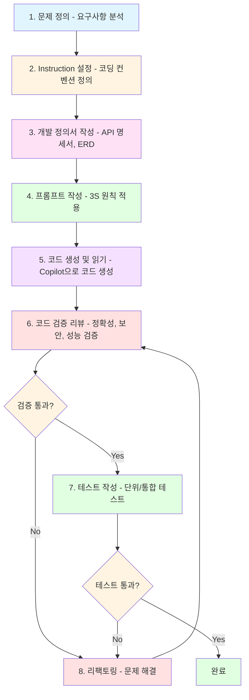
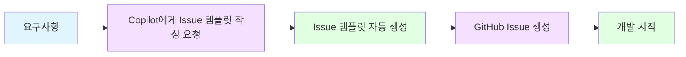
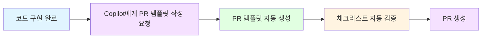
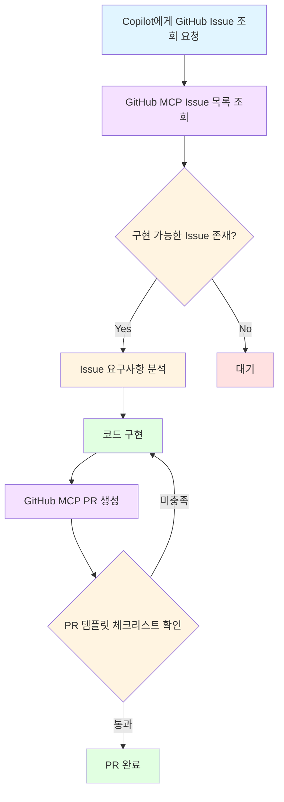
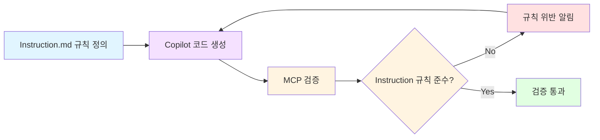
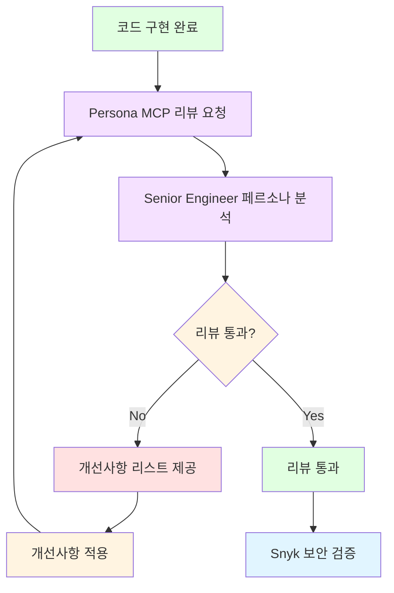
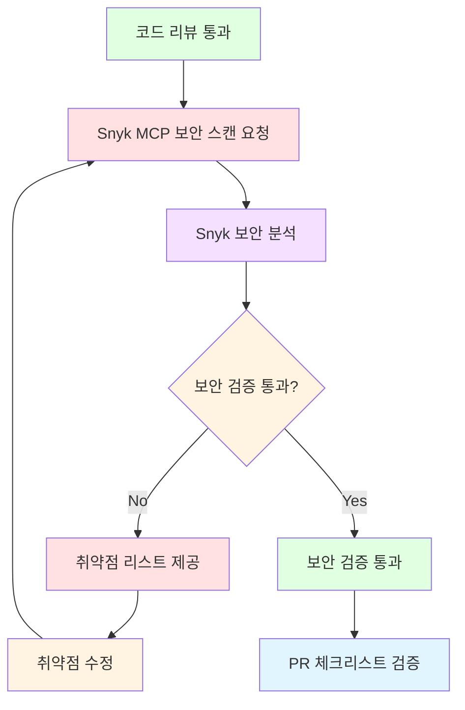
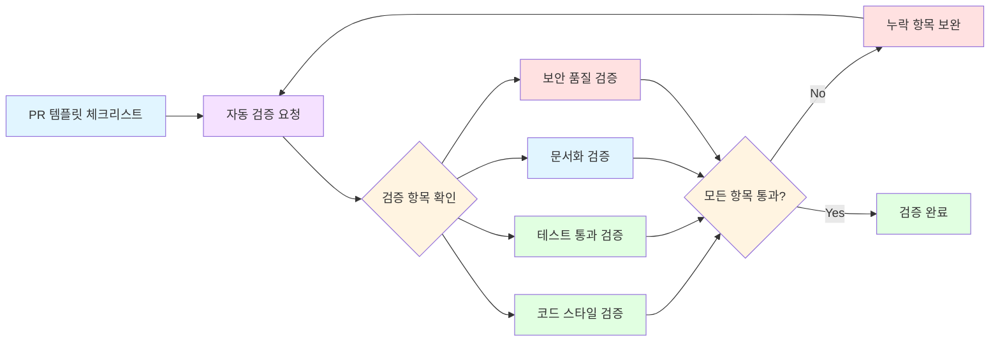
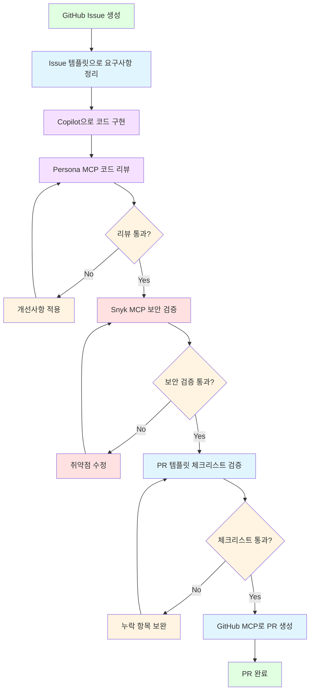
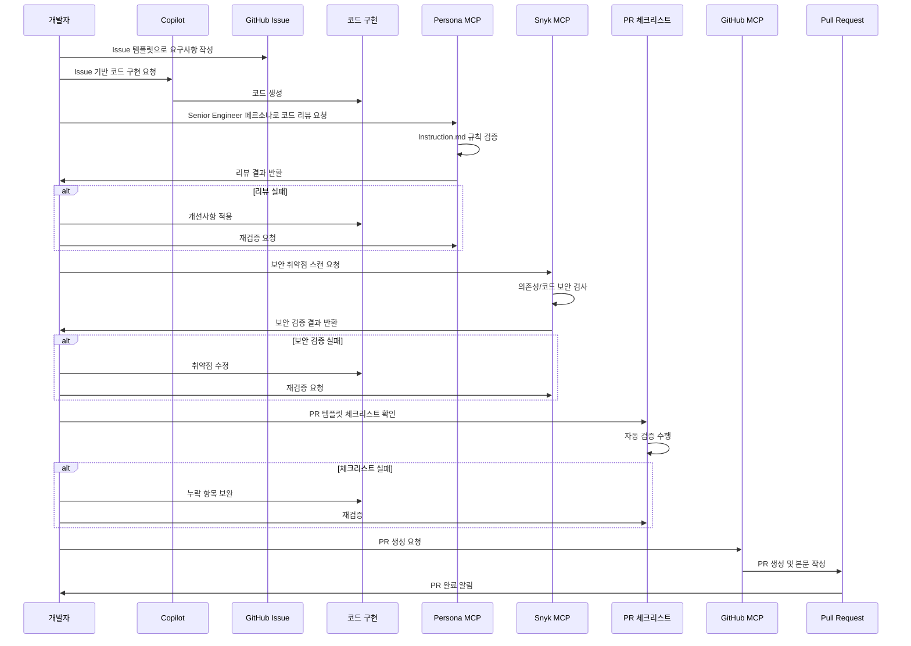

# Copilot Advanced MSA Java 커리큘럼 요약

## 개요

본 문서는 Copilot을 활용한 MSA 프로젝트 개발 교육 커리큘럼의 전체 흐름을 요약한 문서입니다.
각 단계는 순차적으로 진행되며, 이전 단계의 결과물을 다음 단계에서 활용합니다.

---

## 커리큘럼 요약표

| 단계 | 제목 | 주요 내용 | 실습 내용 | 핵심 포인트 |
|------|------|-----------|-----------|-------------|
| **1단계** | 문제 정의 (Problem Definition) | • 요구사항 확인의 중요성<br/>• MSA 프로젝트 요구사항<br/>  - 시스템 개요: E-Commerce MSA<br/>  - 서비스 구성: API Gateway, User/Product/Order Service<br/>  - 기능/비기능 요구사항 | • 요구사항 분석: 서비스 관계 다이어그램 작성<br/>• Copilot 활용: ERD와 API 엔드포인트 정리 요청 | • 명확한 요구사항이 좋은 코드의 시작<br/>• 기능/비기능 요구사항 구분<br/>• 서비스 간 의존성 파악 |
| **2단계** | Instruction MD 가이드 | • Copilot Instruction 개념<br/>• 조직 단위 Instruction 작성법<br/>  - 프로젝트 개요<br/>  - 코딩 컨벤션<br/>  - 패키지 구조<br/>  - 테스트 가이드<br/>• 효과적인 작성 팁 (DO/DON'T) | • Instruction 분석: `.github/copilot-instructions.md` 확인<br/>• Instruction 효과 체험: 삭제 후 비교 | • 일관된 코드 품질을 위해 Instruction 필수<br/>• 프로젝트 초기에 세팅<br/>• 팀 합의로 내용 결정<br/>• 주기적 업데이트 |
| **3단계** | 개발 정의서 작성 (Development Specification) | • 개발 정의서 종류<br/>  - API 명세서<br/>  - ERD (Mermaid)<br/>  - 시퀀스 다이어그램<br/>  - 인터페이스 정의서<br/>• Copilot으로 각 문서 생성 방법 | • API 명세서 생성: Product Service<br/>• 이벤트 흐름 문서화: Kafka 이벤트 시퀀스 다이어그램 | • 명세서가 먼저, 코드는 나중<br/>• Copilot은 문서화 작업에도 강력<br/>• Mermaid 문법으로 다이어그램 자동 생성<br/>• 명세서 기반으로 코드 생성 요청 가능 |
| **4단계** | 프롬프트 가이드 (Prompt Engineering) | • 3S 원칙: Simple, Specific, Structured<br/>• BAD vs GOOD 프롬프트 비교<br/>• 상황별 템플릿<br/>  - 새 클래스 생성<br/>  - 기존 코드 수정<br/>  - 버그 수정<br/>  - 테스트 코드 생성<br/>• MSA 실전 프롬프트 (Kafka Producer/Consumer) | • 3S 원칙 적용: 프롬프트 개선 연습<br/>• 템플릿 활용: 카테고리 검색 기능 추가 프롬프트 작성 | • 3S 원칙: Simple, Specific, Structured<br/>• 템플릿 활용으로 일관된 품질<br/>• 맥락 제공이 핵심<br/>• 점진적 요청 |
| **5단계** | AI 코드 읽기 가이드 (Code Reading) | • AI 코드 이해의 중요성<br/>• 코드 이해 체크리스트<br/>  - 함수/메서드 분석 (입력/출력/부수효과)<br/>  - 호출 방식 분석<br/>  - 타겟 분석<br/>• Copilot으로 코드 분석하기<br/>• MSA 특화 분석 포인트 (Kafka 이벤트 흐름, 서비스 간 의존성) | • 코드 분석: `ProductService.decreaseStock()` 분석<br/>• Copilot 활용 분석: `UserEventProducer` 메서드 분석 | • 맹목적 신뢰 금지: 반드시 이해 후 사용<br/>• 체계적 분석: 입력 → 로직 → 출력 → 부수효과<br/>• Copilot 활용으로 이해 가속화<br/>• MSA 특화: 이벤트 흐름, 서비스 간 의존성 파악 |
| **6단계** | 코드 검증(리뷰) 가이드 (Code Review) | • 코드 검증 필요성<br/>  - 논리적 오류, 보안 취약점, 성능 문제, 표준 위반<br/>• 코드 검증 체크리스트<br/>  - 정확성, 보안, 성능, 유지보수성<br/>• AI 활용 코드 검증 프롬프트<br/>• 실전 예시: 문제 있는 코드 찾기<br/>• Copilot Instruction 활용 코드 검증 | • 수동 코드 리뷰: `UserService.createUser()` 확인<br/>• AI 활용 코드 리뷰: `OrderService` 전체 리뷰 요청 | • 무조건 검증: AI 코드도 반드시 리뷰 필요<br/>• 체크리스트 활용: 정확성, 보안, 성능, 유지보수성<br/>• AI로 검증 가속화<br/>• Instruction에 규칙 추가로 처음부터 좋은 코드 생성 유도 |
| **7단계** | 테스트 가이드 (Testing Guide) | • 테스트 피라미드: 단위 > 통합 > E2E<br/>• 단위 테스트 작성 (JUnit 5 + Mockito)<br/>• Kafka 통합 테스트 (@EmbeddedKafka)<br/>• MSA 통합 테스트 전략<br/>  - 서비스별 독립 테스트<br/>  - 컨트랙트 테스트<br/>  - Docker Compose 통합 테스트<br/>• 테스트 커버리지 확인 | • 단위 테스트 작성: `ProductService.decreaseStock()`<br/>• Copilot으로 테스트 생성: `OrderService` 전체 테스트 | • 테스트 피라미드: 단위 > 통합 > E2E<br/>• Mockito 활용: 외부 의존성 격리<br/>• @EmbeddedKafka: Kafka 통합 테스트<br/>• Copilot 활용: 테스트 케이스 생성 가속화 |
| **8단계** | 리팩토링 가이드 (Refactoring Guide) | • 리팩토링 시점: 6, 7단계에서 문제 발견 시<br/>• Copilot 활용 리팩토링<br/>  - 가독성 개선<br/>  - 중복 코드 제거<br/>  - 성능 개선<br/>• 리팩토링 실전 예시 (Before/After)<br/>• MSA 리팩토링 주의사항<br/>  - 영향도 분석 필수<br/>  - 하위 호환성 유지<br/>  - 배포 전략<br/>• Copilot으로 영향도 분석 | • 메서드 분리 리팩토링: `ProductService.decreaseStock()`<br/>• Copilot 활용 리팩토링: `UserController` 리팩토링 요청 | • 문제 발견 시 리팩토링: 6, 7단계 결과 기반<br/>• 작은 단위로 진행: 한 번에 하나씩 개선<br/>• 테스트 먼저: 리팩토링 전 테스트 확보<br/>• MSA 영향도: 다른 서비스 영향 필수 확인<br/>• 하위 호환성: API/이벤트 변경 시 주의 |

---

## 커리큘럼 흐름도



---

## 전체 핵심 원칙

1. **명확한 요구사항**이 좋은 코드의 시작
2. **Instruction 설정**으로 일관된 코드 품질 확보
3. **명세서 먼저**, 코드는 나중
4. **3S 원칙**으로 효과적인 프롬프트 작성
5. **맹목적 신뢰 금지**, 반드시 이해하고 검증
6. **체계적 검증**: 정확성, 보안, 성능, 유지보수성
7. **테스트 피라미드** 준수
8. **작은 단위 리팩토링**, MSA 영향도 필수 확인

---

## 알아보기: 전체 자동화 파이프라인 (Automation Pipeline)

### 개요

전체 자동화 파이프라인은 개발부터 코드 검증, PR 생성까지의 워크플로우를 자동화하여 개발 생산성과 코드 품질을 향상시키는 주제입니다.
각 단계를 완료한 후 추가로 학습할 수 있는 심화 내용입니다.

### 주요 내용

#### 1. Copilot으로 Issue 및 PR 템플릿 활용법

**Issue 템플릿 활용 워크플로우**



**Issue 템플릿 활용**
- GitHub Issue 템플릿을 활용하여 요구사항을 구조화
- Copilot에게 Issue 템플릿 기반으로 요구사항 정리 요청
- 예시 프롬프트:
  ```
  다음 요구사항을 GitHub Issue 템플릿 형식으로 정리해주세요:
  - 기능 설명
  - 제안 배경
  - 상세 요구사항
  - 기술 스택
  ```

**PR 템플릿 활용 워크플로우**



**PR 템플릿 활용**
- PR 템플릿의 체크리스트를 활용하여 코드 품질 보장
- Copilot에게 PR 템플릿 기반으로 변경사항 정리 요청
- 예시 프롬프트:
  ```
  이번 변경사항을 PR 템플릿 형식으로 작성해주세요:
  - PR 요약
  - 변경 사항
  - 체크리스트 확인
  ```

**템플릿 파일 위치**
- Issue 템플릿: `.github/ISSUE_TEMPLATE/`
- PR 템플릿: `.github/PULL_REQUEST_TEMPLATE.md`

#### 2. MCP와 Instruction.md를 활용한 GitHub 워크플로우 자동화

**MCP (Model Context Protocol) 설정**
- GitHub MCP 서버 설정으로 GitHub API 접근
- Snyk MCP 서버 설정으로 보안 취약점 검사 자동화
- Persona MCP 서버 설정으로 AI 페르소나 코드 리뷰

**MCP 설정 파일 예시** (`mcp.json` 또는 `.cursor/mcp.json`):
```json
{
  "servers": {
    "github": {
      "command": "docker",
      "args": ["run", "-i", "--rm", "-e", "GITHUB_PERSONAL_ACCESS_TOKEN", "ghcr.io/github/github-mcp-server"],
      "env": {
        "GITHUB_PERSONAL_ACCESS_TOKEN": "${input:github_token}"
      },
      "type": "stdio"
    },
    "snyk": {
      "command": "npx",
      "args": ["-y", "snyk@latest", "mcp", "-t", "stdio"],
      "env": {
        "SNYK_TOKEN": "${input:snyk_token}"
      },
      "type": "stdio"
    },
    "persona-sessions": {
      "command": "python",
      "args": ["<path-to>/mcp-persona-sessions/mcp-persona-sessions.py"],
      "type": "stdio"
    }
  },
  "inputs": [
    {
      "id": "github_token",
      "type": "promptString",
      "description": "GitHub Personal Access Token",
      "password": true
    },
    {
      "id": "snyk_token",
      "type": "promptString",
      "description": "Snyk API Token",
      "password": true
    }
  ]
}
```

> **Note**: persona-sessions는 Python 기반 MCP 서버입니다.
> 설치: `git clone https://github.com/mattjoyce/mcp-persona-sessions.git && pip install fastmcp pyyaml`

**Snyk MCP - 보안 취약점 스캔**

| 검사 항목 | 예시 |
|-----------|------|
| 의존성 취약점 | outdated libraries, CVE 검출 |
| 보안 이슈 | SQL Injection, XSS, 암호화 미흡 |
| 라이선스 준수 | 라이센스 정책 위반 검출 |
| IaC 보안 | Docker, Kubernetes 설정 취약점 |

**Snyk 사용 시점:**
- 새 라이브러리 추가 후
- 보안 관련 코드 작성 후
- 배포 전 보안 검증

**Persona MCP - AI 페르소나 대화**

| 사용 사례 | 설명 |
|-----------|------|
| 코드 리뷰 | Senior Engineer 페르소나로 코드 검토 |
| 문제 해결 | 다양한 관점에서 아이디어 브레인스토밍 |
| 학습 | 멘토 역할로 기술 지도 |

**Persona 사용 시점:**
- 의사결정 전 다각도 검토 필요할 때
- 기술 학습/멘토링 필요할 때
- 아키텍처/설계 피드백 필요할 때

**GitHub Issue 확인 및 PR 생성 자동화 워크플로우**



**GitHub Issue 확인 및 PR 생성 자동화**

Copilot에게 MCP를 통해 GitHub Issue 조회 및 PR 생성을 요청할 수 있습니다.

> **1. GitHub MCP 동작 확인**
> ```
> "현재 GitHub MCP가 제대로 작동하는지 확인하고 싶어.
> Ai-Advanced 조직 안에 있는 repo 갯수와 가장 최근 repo 이름을 보여줘."
> ```

> **2. Issue 기반 개발 및 PR 생성 워크플로우**
>
> **Step 1️⃣ Issue 확인 및 브랜치 생성**
> ```
> GitHub MCP를 사용해서 현재 열려있는 #34번 Issue가 누군가 작업중인지 확인해줘.
> 할당된 사람이 없다면, 내 로컬에서 오늘 날짜로 feat 브랜치 새로 하나 파서 작업 진행해줘.
> ```
>    - 위 프롬프트에서 Copilot에게 요구한 내용
>        1. #34 번 이슈 작업중인지 확인하고,
>        2. if 작업자x: 
>        3. 내 로컬환경에서,
>        4. 오늘 날짜 + 회사가 정한 브랜치 name 규칙으로,
>        5. 브랜치 만들고, #34번 이슈 작업 진행해라.
>
> **Step 2️⃣ 체크리스트 검증**
> ```
> 현재 작업 요구사항이 #34번 Issue의 체크리스트를 모두 통과했는지 확인해줘.
> ```
> - ❌ 통과 실패 시 → `체크리스트를 통과하게끔 코드 수정해줘.`
> - ✅ 통과 성공 시 → Step 3으로 이동
>
> **Step 3️⃣ PR 생성**
> ```
> #34 Issue를 기반으로 현재 feat 브랜치에서 develop 브랜치로 가는 PR 생성해줘.
> ```
> - 📄 회사 템플릿 사용 시 → `.github/ 안에 있는 PULL_REQUEST_TEMPLATE.md 템플릿을 활용해서 PR 생성해줘.`

**Instruction.md와의 연계 워크플로우**



**Instruction.md와의 연계**
- `.github/copilot-instructions.md`에 정의된 규칙을 MCP 검증에 활용
- Copilot이 Instruction 규칙을 자동으로 준수하는지 확인

#### 3. MCP를 이용한 코드 품질 및 보안 자동 검증

**Persona MCP를 통한 코드 리뷰 워크플로우**



**Persona MCP를 통한 코드 리뷰**
- 구현 완료 후 Persona MCP로 AI 페르소나 코드 리뷰 요청
- 예시 프롬프트:
  ```
  Persona MCP를 사용해서 Senior Engineer 페르소나로 다음 코드를 리뷰해주세요:
  - 코드 품질 개선점
  - 아키텍처 패턴 준수 여부
  - Instruction.md 규칙 준수 여부
  - 유지보수성 검토
  ```

**Snyk MCP를 통한 보안 검증 워크플로우**



**Snyk MCP를 통한 보안 검증**
- 코드 리뷰 통과 후 Snyk MCP로 보안 취약점 스캔 요청
- 예시 프롬프트:
  ```
  Snyk MCP를 사용해서 다음 항목을 검증해주세요:
  - 의존성 취약점 (CVE 검출)
  - 코드 보안 이슈 (SQL Injection, XSS 등)
  - 라이선스 정책 준수 여부
  - Docker/Kubernetes 설정 보안
  ```

**PR 체크리스트 자동 점검 워크플로우**



**PR 체크리스트 자동 점검**
- PR 템플릿의 체크리스트 항목을 자동으로 검증
- 예시 프롬프트:
  ```
  PR 템플릿의 체크리스트를 확인하고,
  다음 항목들이 통과하는지 검증해주세요:
  - 코드 스타일 & 포맷팅
  - 테스트 통과 여부
  - 문서화 완료 여부
  - 보안 & 품질 검증
  ```

**전체 자동화 워크플로우 (Persona + Snyk 조합)**



**상세 워크플로우 단계**



### 실습

1. **Issue 템플릿 활용**: 새로운 기능 요청을 Issue 템플릿 형식으로 작성
2. **MCP 설정**: GitHub MCP, Snyk MCP, Persona MCP 서버 설정
3. **자동화 워크플로우 체험**: 
   - Issue 조회 → 코드 구현 → Persona 리뷰 → Snyk 보안 검증 → PR 생성
4. **체크리스트 자동 검증**: PR 템플릿의 체크리스트를 자동으로 확인

### 핵심 포인트

1. **템플릿 활용**: Issue/PR 템플릿으로 일관된 문서화
2. **MCP 활용**: GitHub 워크플로우 자동화로 생산성 향상
3. **Persona 코드 리뷰**: AI 페르소나로 다양한 관점의 코드 품질 리뷰
4. **Snyk 보안 검증**: 보안 취약점 자동 검사로 안전한 코드 보장
5. **Instruction 연계**: Instruction.md 규칙을 자동 검증에 활용
6. **체크리스트 자동화**: PR 템플릿 체크리스트 자동 점검

---

## 참고 문서

각 단계별 상세 가이드는 다음 문서를 참고하세요:
- [01-problem-definition.md](./01-problem-definition.md)
- [02-instruction-guide.md](./02-instruction-guide.md)
- [03-development-spec.md](./03-development-spec.md)
- [04-prompt-guide.md](./04-prompt-guide.md)
- [05-code-reading-guide.md](./05-code-reading-guide.md)
- [06-code-review-guide.md](./06-code-review-guide.md)
- [07-testing-guide.md](./07-testing-guide.md)
- [08-refactoring-guide.md](./08-refactoring-guide.md)
