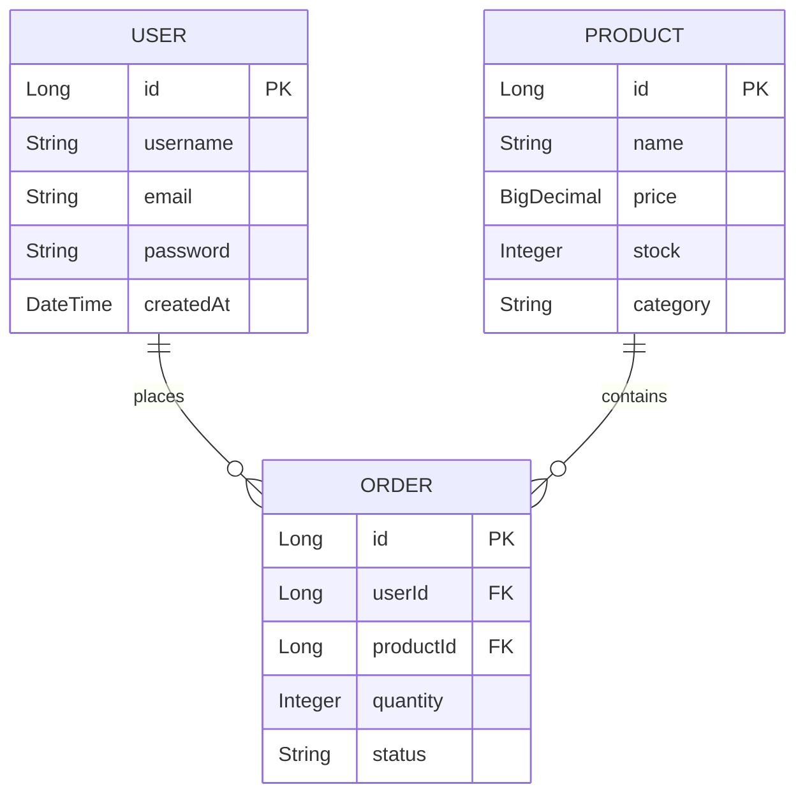
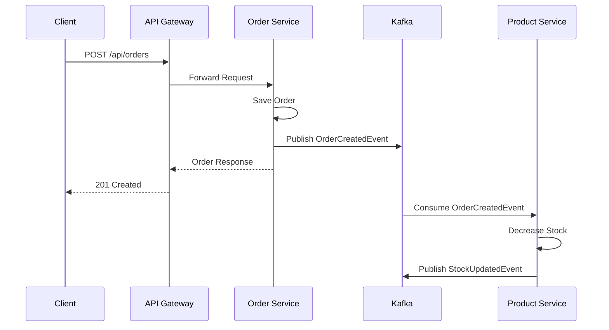

# 3. 개발 정의서 작성 (Development Specification)

## 학습 목표
- Copilot을 활용한 개발 정의서 작성 방법 습득
- API 명세서, ERD 등 문서화 자동화 학습

---

## 교육 내용

### 3.1 개발 정의서란?

개발 정의서는 **구현 전 설계 문서**입니다:
- API 명세서
- ERD (Entity Relationship Diagram)
- 시퀀스 다이어그램
- 인터페이스 정의서

### 3.2 Copilot으로 API 명세서 생성

#### 프롬프트 예시

```
User Service의 API 명세서를 작성해주세요.
다음 기능이 필요합니다:
- 사용자 생성 (POST)
- 사용자 조회 (GET)
- 사용자 삭제 (DELETE)

형식은 아래와 같이 해주세요:
| Method | Endpoint | Description | Request | Response |
```

#### 예상 결과

| Method | Endpoint | Description | Request Body | Response |
|--------|----------|-------------|--------------|----------|
| POST | /api/users | 사용자 생성 | CreateUserRequest | UserResponse |
| GET | /api/users/{id} | 단일 사용자 조회 | - | UserResponse |
| GET | /api/users | 전체 사용자 목록 | - | List\<UserResponse\> |
| DELETE | /api/users/{id} | 사용자 삭제 | - | - |

### 3.3 Copilot으로 ERD 생성

#### 프롬프트 예시

```
다음 엔티티들의 ERD를 Mermaid 문법으로 작성해주세요:
- User: id, username, email, password, createdAt
- Product: id, name, price, stock, category
- Order: id, userId, productId, quantity, status
```

#### 예상 결과



### 3.4 Copilot으로 시퀀스 다이어그램 생성

#### 프롬프트 예시

```
주문 생성 프로세스의 시퀀스 다이어그램을 Mermaid로 작성해주세요:
1. 클라이언트가 API Gateway로 주문 요청
2. API Gateway가 Order Service로 전달
3. Order Service가 주문 저장 후 Kafka 이벤트 발행
4. Product Service가 이벤트 수신 후 재고 차감
```

#### 예상 결과



---

## 실습

### 실습 1: API 명세서 생성
Copilot에게 Product Service의 API 명세서를 요청해보세요.

**프롬프트**:
```
Product Service API 명세서를 작성해주세요.
기능: 상품 CRUD, 재고 증가
형식: 표 형태로
```

### 실습 2: 이벤트 흐름 문서화
Kafka 이벤트 흐름을 시퀀스 다이어그램으로 작성해보세요.

---

## 핵심 포인트
1. **명세서가 먼저**, 코드는 나중
2. Copilot은 **문서화 작업**에도 강력
3. **Mermaid 문법**으로 다이어그램 자동 생성
4. 명세서를 기반으로 **코드 생성 요청** 가능

